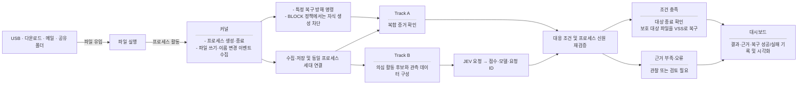

# Ransom0

```mermaid
flowchart LR
    %% 파일 유입 및 탐지
    A["USB · 다운로드 · 메일 · 공유 폴더"]
    B["파일 실행"]
    C["커널<br/><hr/>- 프로세스 생성·종료<br/>- 파일 쓰기·이름 변경 이벤트 수집"]
    A --> |파일 유입| B
    B --> |프로세스 활동| C

    %% 랜섬웨어 확정
    K["- 특정 복구 방해 명령<br/>- BLOCK 정책에서는 자식 생성 차단"]
    E["Track A<br/><hr/>복합 증거 확인"]
    C --> K
    K --> E
    E --> H

    %% 랜섬웨어 의심
    D["수집·저장 및 동일 프로세스 세대 연결"]
    F["Track B<br/><hr/>의심 활동 후보와 관측 데이터 구성"]
    G["JEV 요청 → 점수·모델·요청 ID"]
    C --> D
    D --> E
    D --> F
    F --> G
    G --> H

    %% 분석/복구
    H["대응 조건 및 프로세스 신원 재검증"]
    J["근거 부족·오류<br/><hr/>관찰 또는 검토 필요"]
    I["조건 충족<br/><hr/>대상 종료 확인<br/>보호 대상 파일을 VSS로 복구"]
    H --> J
    H --> I

    %% UI 전달 및 시각화
    L["대시보드<br/><hr/>결과·근거·복구 성공/실패 기록 및 시각화"]
    I --> L
    J --> L
```
